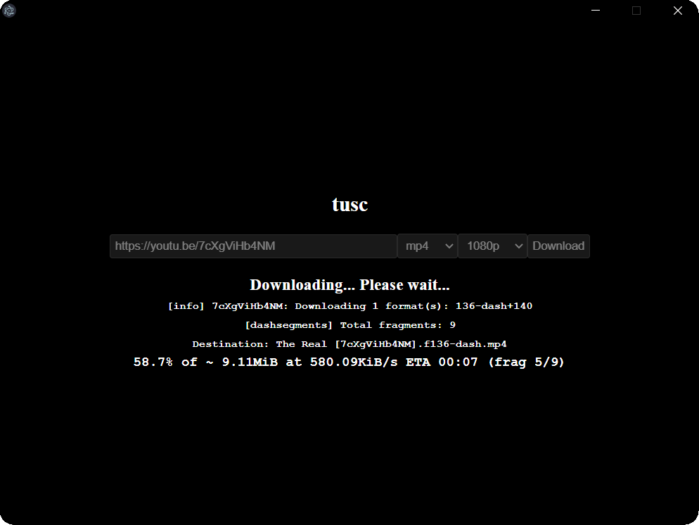

# tusc-gui

Tusc GUI is an accesible, easy to use version of [tusc][tusc]. It uses [yt-dlp][yt-dlp] behind the scenes.

## Motivation

Ever used one of those YouTube downloader websites that display ads every few clicks and are slow as hell? Well, this is the opposite of that. It's a simple, fast, and easy to use YouTube downloader that doesn't have any ads or trackers.

It started out as a personal project that I think can useful for some people, myself included.

If you for some reason, prefer to do this in the command line, you can use [tusc][tusc], or [yt-dlp][yt-dlp] directly if you want things to be more technical.

## Installation

You can download the latest release from [here](https://github.com/SuperchupuDev/tusc-gui/releases/latest)

[tusc]: https://github.com/SuperchupuDev/tusc
[yt-dlp]: https://github.com/yt-dlp/yt-dlp
